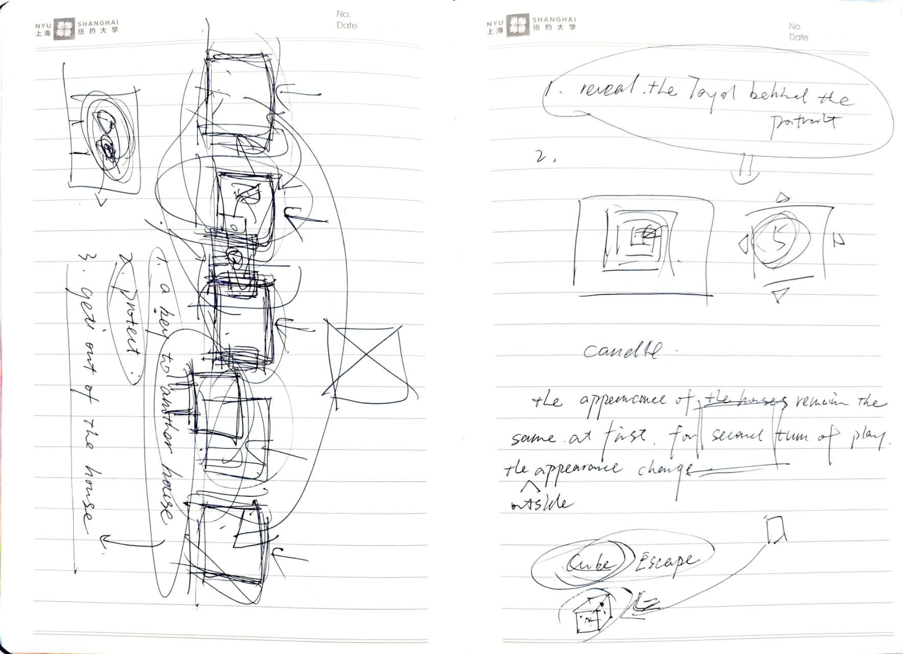
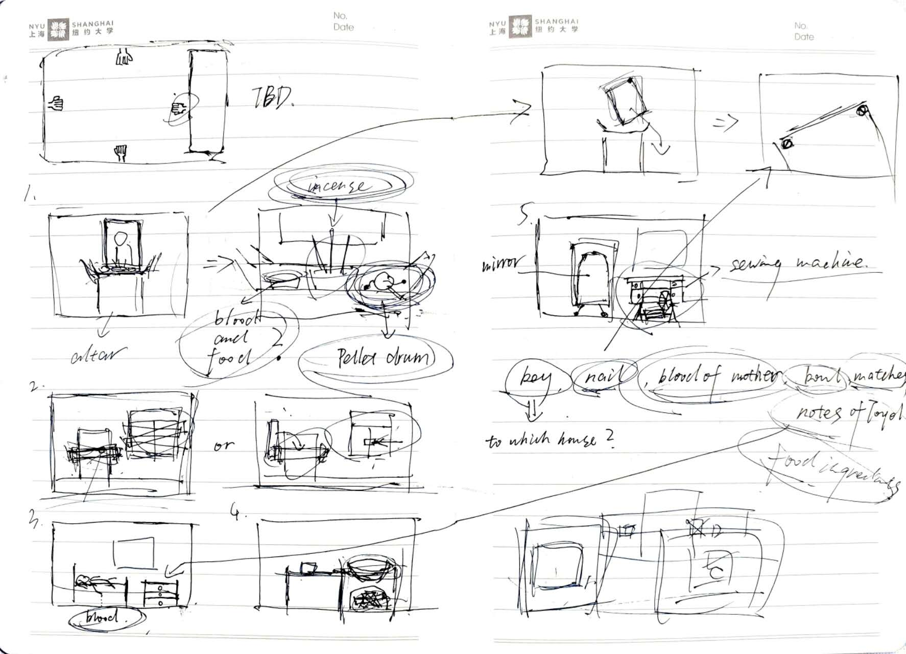

# 09/29/2024
OK. I guess this is the start.

In our first formal group meeting, I proudly presented my "stupid" idea to the whole group. The day before this meeting, I was wandering around the local park looking for inspiration. And then, it just hit me. BOOM! A burst of creativity borrowed from Mother Nature—hopefully, I won’t need to return it, lol. Anyway, here’s my idea:
I saw a cool video on Instagram. Using clever video editing techniques, the creator made a visual effect where the person walks at a normal speed, but the background flashes by as if time itself is rushing forward. It gave me the feeling of time travel—everything around the character changes while they remain unaffected, like an immovable rock on the road. This reminded me of an interesting concept I’d heard: that rocks are actually living creatures, just moving too slowly for us to perceive their behavior. I want the protagonist of our game to be the rock!

Next, the game would draw inspiration from Chinese history—something I’ve wanted to incorporate into a project for so long. The massive waves of change in government, society, and ideology during modern Chinese history perfectly fit this time-traveling concept.

And of course, the game had to involve ghosts. Ghosts are timeless, often unchanged by the passage of years. In many fascinating ghost stories, ghosts serve as sources of reliable yet unprovable evidence. Facing a ghost to uncover the truth creates a tension that keeps the story haunting and engaging. That said, I’m tired of jump scares and the grotesque depictions of ghosts we see everywhere. So, I thought: what if the player is the ghost?

And there you have it! The main character of our game: Toyol, a ghost created from the body of an undead infant.

# 10/02/2024
Based on the concept, we had a pretty productive conversation and came up with lots of design strategies for our game. My initial idea was for the main character to stay in the same house but experience it at different points in time. The changes in the decorations and furniture inside the house would represent the passage of time and reflect the societal changes happening outside. The protagonist would travel through time by stepping outside the house, with the background flashing past—just like the Instagram video I mentioned earlier, creating the effect of time travel.

One thing that surprised me was Savannah’s suggestion for a better way for our main character to travel through time. She proposed a neighborhood where houses have the same structure but different appearances. Entering these houses would subtly represent staying in the same house during different time periods. This design adds an extra layer of magic to the game, and I absolutely love it.

For more details about what else we discussed, here is the [Link to the notes](../MeetingsMinutes/BSnotes.pdf)

# 10/15/2024
Something interesting happened within the team recently. I had some conflicts with a teammate. While the experience was unpleasant, it gave me an opportunity to reflect on how I collaborate with others and, more importantly, on the core argument I want to convey through this game. As I shared in the group chat:

" I do want to insist on including the mom killing the enemy's baby in our game because it's highly related to the argument I want to make through the game.
War is cruel, and survival becomes the sole priority. Violence, betrayal, cannibalism, and rape were rampant during that period—not only perpetrated by Japanese invaders against Chinese people, but also among the Chinese themselves. It's like the classic dilemma in This War of Mine: being a victim doesn't mean you're free from committing crimes. Killing the invader's baby doesn't justify the invasion. Victims can be extremely aggressive. If they ever get a chance for revenge, they will desperately take it.
War is complex, and so are the people caught in it."

# 11/03/2024
All the conflicts were finally resolved, and I’ve taken on responsibility for the narrative and interaction design aspects of the game. For this week’s meeting, I had all the character settings and the background story completed, as outlined in the [Story Bible](../Jack/Toyol_Bible.pdf).

The game draws inspiration from Chinese history and centers on the complex relationship between a woman and a ghost (you, the player). The woman raised and fed you, but she was also the one who killed you and turned you into a ghost. Meanwhile, your biological father, when you were a human baby, was a general of the invaders who murdered the woman’s entire family, including her child. This setup creates the key tension in the game’s narrative: layers of betrayal, revenge, and survival.

For the puzzle design, my ideas were still somewhat vague, with only rough, unintelligible sketches in my notebook. However, a few core concepts are already clear:

The game will feature five houses, each representing a specific point on the timeline. These houses share similar structures but differ in appearance both inside and outside.
Players will spend most of their time inside the houses but will have opportunities to explore the neighborhood, gather clues, and unlock new houses with keys they find.
Each house will include five key scenes:

Kitchen, Bedroom, Small Room (Sewing Machine Room), Front Door, Altar

Players will need a visual or narrative representation to track their progress and a medium to observe changes over time—in this case, transitions between different houses, as each represents a different time period.

Our current plan is to focus on creating three of the five houses and prioritize development on the third house.

As for potential interactable items, here’s a preliminary list:

Keys, Nail, Blood, Meat, Bowl, Incense, Matches, Notes related to the Toyol ritual

# 11/14/2024

I’ve completed almost all the puzzle designs for the game, as outlined in the second part of the [Story Bible](../Jack/Toyol_Bible.pdf). The pellet drum will serve as a subtle representation of time within the game, while a sweater—which the player will be tasked with knitting in each house—will act as a more explicit marker of time. Additionally, a wardrobe will function as the medium for time travel. Essentially, if the player finds an item in House 1 and places it in the wardrobe, the item will appear in House 2.

However, there’s one thing I’ve been grappling with: the significance of the number five. We currently have five scenes in each house, but the number doesn’t hold any specific meaning. Would four scenes make more sense, since a house is more like a cube with four horizontal faces? This is something I’m still debating.

Another area of uncertainty is how the endings should play out. There are definitely two endings planned, based on the player’s previous behaviors, but I’m unsure whether to give players the option to forgive the woman.

If the player chooses to kill the woman, what would the consequences be?

If the player chooses to forgive the woman, would the woman forgive the player in return? What if she doesn’t? What if the woman transfers her hatred of the invaders to the player instead?

These questions remain unresolved, and I’m still exploring the narrative possibilities they could open up.

# 11/22/2024

I created a [checklist](../Jack/Arts_Checklist.pdf) of all the art assets for Savannah to work on — there’s a lot to tackle! I’ve also started searching for sound effects and background music for the game to bring the atmosphere to life.
