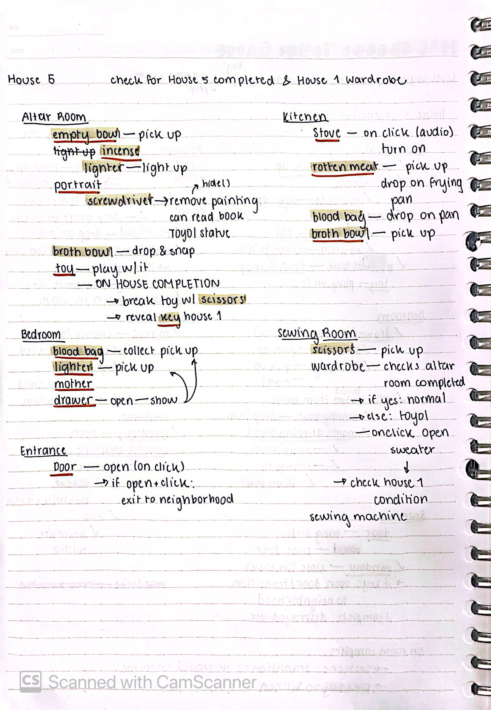

# Thais's MDM Journal Entries

Note: this entries are in addition to the GitHub Commit messages to explain a bit more about what went on. Some of the design aspects (such as my logic mapping) can be better represented with images. Additionally, I am giving some context to things we did as a group and to some of the moments that helped shaped the project that are perhaps not reflected in the Github commits. 

## Final Short Reflexion

I really enjoyed working on this project. I am very happy with the technical implementation. We got a lot done despite having one group member less. I am very happy. I also loved seen our user test playthrough with the class. It was so much fun!

I liked MDM as a possible methodology. One of my commits goes more into depth but I think that the method is very useful to tracking the process of the project. Additionally, I think it is very useful for the developers to get back on track. Having a more descriptive text about the commits really helped me refresh what I was doing when I came back from my conference. I believe I will be revisiting this in future projects.

I loved Godot as an engine. The learning curve was a bit steep for me, but overall I really love the engine. It does a lot and once you get a hang of GDScript it's not so bad. I am for sure going to be using this more. Specially given that I don't need a liscence. My favorite part of the class was having to learning by doing in Godot. 

I want to do more postcolonial perspectives in my design. I think that this perspective is very intersting in the context of game design. If I was to revisit Toyol, I would like to rethink the idea of an inventory. It is the key compenent of our game. Though I decided to not incorporate mining in the game due to its colonial mechanic, I still wonder if there could be another way of showing the inventory in a more nuanced way. If I had more time to think about the inventory mechanic as adding to the discussion of colonialism in our game, then I would for sure have gone to the route of reframing the inventory system. 

## Literally three hours after final presentation

The sweater, which checks for state of house completion in the game is now working! Also the save/load game states from the menu bar are all working (on Windows only)! The issue of the sweater was layering. I am still a bit confused by how Godot handles layering because many of the assets I have should show by hierarchy order. However, the sweater was completely disregarding this layering order for some reason. So the sweater was working during the class demo, we just couldn't see it because it was behind the closet sprite. 

## 3/11/2024

Moment of epiphany! I realized that I can just readapt the logic that Jack used and turn it into a point-clicker system instead (the same one I've been doing with Popochiu). I think that this will be relatively easy to implement and get a working version. I should have thought of this sooner lol. It means I have to take Savannah's art and resize everything by a bit. Still a solution though! 

## 2/11/2024

Incorporating the sound into the game was more time consumming than I expected. There were some sound assets that we did not think about such as the GUI on click sound and many smalled sfx (for example the sound of something solid falling into a liquid or when you burn something in the stove). I edited a few of the sounds to make them play better (mainly trimming audio so that it starts as soon as I call play method). 

I also sadly could not implement the current version of the Neighborhood scene in the final build for Godot. The scene works relatively well, however there are issues with the collisions were the character will get stuck and the only way of reseting is by restarting the game. Because of how long it takes to complete the first house, I really want the Neighborhood scene to not give any issues that will require a complete game reset (also given that I still need to test interactions and saved states from the other two houses).   

## 29/11/24

I got very sick on Tuesday night. Wednesday and Thanksgiving was spent with a giant headache and a congestioned faced. I sadly was not able to advance at all in the game. Today I decided to get back into action by writing out the logic needed for house 5 (second house player goes through). I will continue to refine the player state of house 3 (first house in playthrough). My main objectives for this weekend is to have the first house completely finalized and the other houses layed out as scenes. That way I can focus on the case states on Monday and adding in the sound effects and the Neighborhood scene. 

## 26/11/24

Today I sat down with Savannah and worked on exporting all the art assets of the game and incorporating them into Godot. I exchanged the provisional drawings I had and switched them over to Savannah's artwork. It really made all the difference. I think that having the art truly changed the vibe of the game. I am also very impressed that we got to basically finish the first house (in terms of interactions and art layout) today. I just need to continue working on the state machine to have the house completed states set up and check for during the gameplay. Savannah did a great job at incorporating elements from the art inspirations provided by Jack. Something that we dedicate quite a while to was exporting the files as sprites that I could then program into Godot to generate animations. I taught Savannah how to use [Codeshack's Sprite Sheet Generator](https://codeshack.io/images-sprite-sheet-generator/) to make the sprites faster given that she already had most of the case states needed for the spritesheets. 

I am just so happy that nothing broke during the import of the new assets! I think that the switching to the Popochiu plugin allowed me to focus more on the file management and how to make my life easier by having each interactable item have a folder with a texture (image) that I can then swap with Savannah's art. 

Additionally, I tasked Jack with finding the sound effects for the game given that he is more familiar with some of the cultural elements (such as the traditional sewing machine, the toy and the traditional music). Something that started to become apparent throughout the design of the game is that even things like what the music could be is very much influenced by how we've seen Asian music portrayed in media. Our group is trying to veer away from cultural stereotypes, so we thought it prudent to assign the sound assets to a member more familiar with the sonic environment of the spaces we are portraying. 

## 24/11/24

I sketched out a breakdown of the objects in every scene and whether or not they are just interactable props or items that will be added to inventory. This helped me sort out how I have to set up the objects within the rooms of the game. It was a very helpful state that helped me quickly remake the rooms with the new Popochiu addon. 

## 23/11/24

### Incorporating Popochiu addon for Godot

[The Itch.io website for Popochiu](https://carenalga.itch.io/popochiu)

[Documentation](https://carenalgas.github.io/popochiu/getting-started/creating-a-game-stub/introduction/)

[Github](https://github.com/carenalgas/popochiu)

Today, very randomly, I found myself falling down the rabbit hole of Spanish developers in YouTube. There are not that many tutorials in general for programming in Spanish, much less game development. However, I stumbled upon this great tutorial series explaining how to use a Godot addon called Popochiu. Popochiu was created as a developer-friendly addon for the creation of point-and-click adventure games. The tutorial series were from a legacy version of Popochiu (from two years ago). However, I went through the documentation and tried it out in a separate Godot project to see if the addon was indeed worth transitioning to. 

I was very impressed with the quality of the addon, the ease of use and how similar it was to the way I was already handling things in my vanilla (no addons or plugin) version of the game in Godot. What Popochiu helps me with is to have reusable scripts that are in-built with the objects. 

Popochiu uses 4 types of baseline nodes/scripts in each room:
- Props
- Hotspot
- Markers
- Character
This means that I can create a prop node in Godot (using Popochiu) and not have to worry about writing down all of the prop functionality again. Instead, I can focus on individual aspects of that specific prop (such as state conditions, aniimations, special interactions etc). It thus becomes very easy to focus on the state conditions rather than manually handling a lot of basic functionality by copy-pasting the code.

Man, I really wish I had found this addon one or two weeks ago. It's great! A bit finicky when erasing, but if you take your time to learn the pipeline then it works like a charm. Knock on wood. 

## 22/11/24

Todo list for next week:

- [x] Import animation assets from Savannah's folder
- [x] Finished Kitchen and altar room
- [x] Unlock Key to the other house + allow player to exit house
- [x] Make final version of inventory
- [ ] Make a player Manager for the States
- [x] Full playthrough test of House 1
- [ ] Start adding sound effects

## 11/11/24 -- Letters from Abu Dhabi من أبو ظبي 

My updates: I created a new version of house 1 with the refactored House Manager. It moves across the different rooms of the house. I also drew some place holders (very quickly) to start building the scenes. I just want to get the logic right with this temporary assets and switch them with Savannah's artwork later on. 

For this week, Jack and Savannah will be making a list of the assets needed for the final project. The idea is to help Savannah by setting the list with all possible assets and prioritizing the ones that we absolutely need. This way she can get started on those. I can then switch the artwork and keep the rest as placeholders until we have all the finalized assets in. I also tasked Jack with making the Neighbohood scene that will allow the player to transition between houses. This scene is very important for the movement between houses.  

## 3/11/24

Started reworking the game scene manager. I sketched out the logic of the game with pencil and paper. This helped me visualize the different scenes of the game and how they connect with each other. It also help me understand what types of components will be reused throughout the scenes. 

I then used Figma to briefly device what components I will need to make and how they could be applied in the scene logically. I have not used Figma that much in my education and career, but I found that making this extra step of wireframing instead of directly going from paper to Godot, help me clarify some things, specifically that the Inventory should be a UI component that is then added to the bigger House UI canvas layer. Due to time constrains, I am unsure of whether or not I'll be using Figma to make all of the logic of the game, but I've found it valuable for the scene management. We shall see.

[Link to the Figma File](https://www.figma.com/design/okMf9c0su3L4Cy5HAxZ7iT/Untitled?node-id=0-1&t=7S7HMwDRMww75usj-1)
