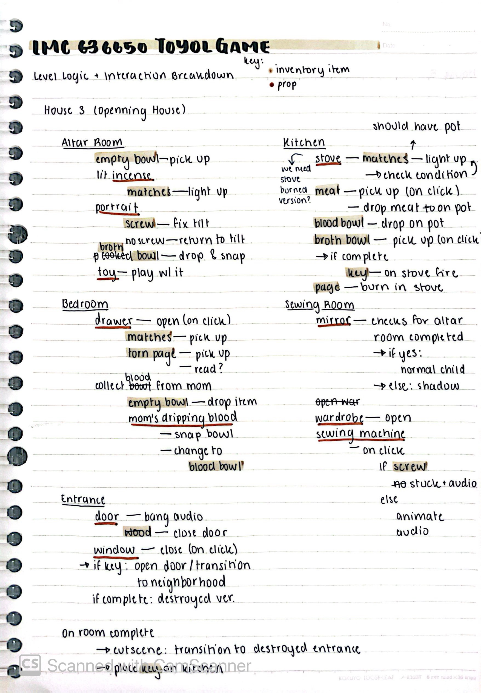
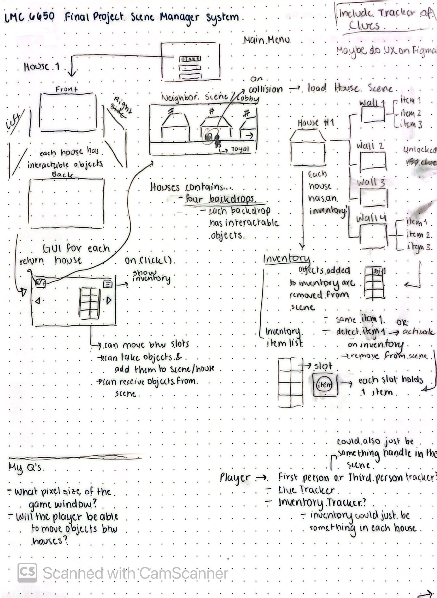

# Thais's MDM Journal Entries

## 24/11/24

I sketched out a breakdown of the objects in every scene and whether or not they are just interactable props or items that will be added to inventory. This helped me sort out how I have to set up the objects within the rooms of the game. It was a very helpful state that helped me quickly remake the rooms with the new Popochiu addon. 

## 23/11/24

### Incorporating Popochiu addon for Godot

[The Itch.io website for Popochiu](https://carenalga.itch.io/popochiu)

[Documentation](https://carenalgas.github.io/popochiu/getting-started/creating-a-game-stub/introduction/)

[Github](https://github.com/carenalgas/popochiu)

Today, very randomly, I found myself falling down the rabbit hole of Spanish developers in YouTube. There are not that many tutorials in general for programming in Spanish, much less game development. However, I stumbled upon this great tutorial series explaining how to use a Godot addon called Popochiu. Popochiu was created as a developer-friendly addon for the creation of point-and-click adventure games. The tutorial series were from a legacy version of Popochiu (from two years ago). However, I went through the documentation and tried it out in a separate Godot project to see if the addon was indeed worth transitioning to. 

I was very impressed with the quality of the addon, the ease of use and how similar it was to the way I was already handling things in my vanilla (no addons or plugin) version of the game in Godot. What Popochiu helps me with is to have reusable scripts that are in-built with the objects. 

Popochiu uses 4 types of baseline nodes/scripts in each room:
- Props
- Hotspot
- Markers
- Character
This means that I can create a prop node in Godot (using Popochiu) and not have to worry about writing down all of the prop functionality again. Instead, I can focus on individual aspects of that specific prop (such as state conditions, aniimations, special interactions etc). It thus becomes very easy to focus on the state conditions rather than manually handling a lot of basic functionality by copy-pasting the code.

Man, I really wish I had found this addon one or two weeks ago. It's great! A bit finicky when erasing, but if you take your time to learn the pipeline then it works like a charm. Knock on wood. 

## 22/11/24

Todo list for next week:

- [x] Import animation assets from Savannah's folder
- [ ] Finished Kitchen and altar room
- [ ] Unlock Key to the other house + allow player to exit house
- [x] Make final version of inventory
- [ ] Make a player Manager for the States
- [ ] Full playthrough test of House 1
- [ ] Start adding sound effects

## 11/11/24 -- Letters from Abu Dhabi من أبو ظبي 

My updates: I created a new version of house 1 with the refactored House Manager. It moves across the different rooms of the house. I also drew some place holders (very quickly).

## 3/11/24

Started reworking the game scene manager. I sketched out the logic of the game with pencil and paper. This helped me visualize the different scenes of the game and how they connect with each other. It also help me understand what types of components will be reused throughout the scenes. 

I then used Figma to briefly device what components I will need to make and how they could be applied in the scene logically. I have not used Figma that much in my education and career, but I found that making this extra step of wireframing instead of directly going from paper to Godot, help me clarify some things, specifically that the Inventory should be a UI component that is then added to the bigger House UI canvas layer. Due to time constrains, I am unsure of whether or not I'll be using Figma to make all of the logic of the game, but I've found it valuable for the scene management. We shall see.

[Link to the Figma File](https://www.figma.com/design/okMf9c0su3L4Cy5HAxZ7iT/Untitled?node-id=0-1&t=7S7HMwDRMww75usj-1)
